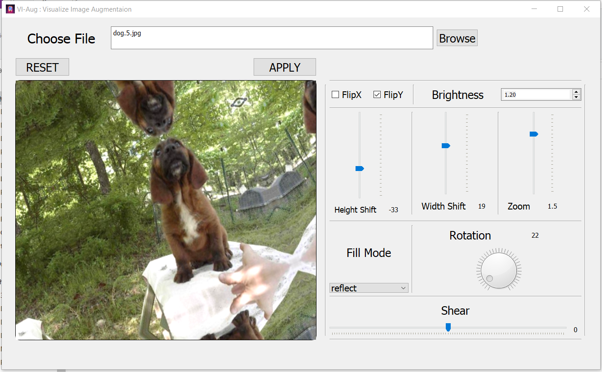
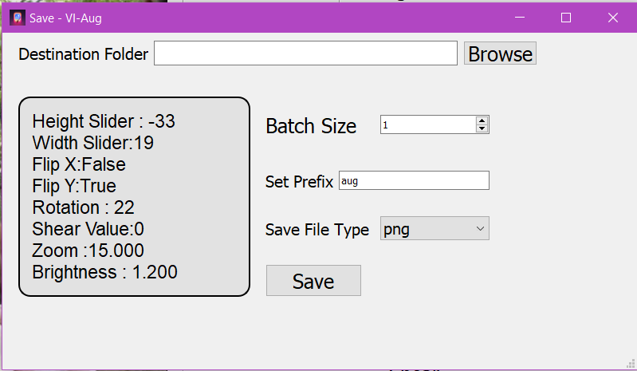

# VI-AUG
## Visualize Image Augmentation
A GUI based image-augmentation tool for creating augmented image dataset implemented.

# Project Directory

* /assets/&nbsp; &nbsp;&nbsp;: MakeData.ui,Interface.ui,logo.png,temp.png.
* /sample/&nbsp;&nbsp;: Sample images to test run.
* /test/&nbsp;&nbsp;&nbsp;&nbsp;&nbsp;&nbsp;&nbsp;&nbsp;: Sample of tested images.
* /&nbsp;&nbsp;&nbsp;&nbsp;&nbsp;&nbsp;&nbsp;&nbsp;&nbsp;&nbsp;&nbsp;&nbsp;&nbsp;&nbsp;&nbsp;: 
    >> * aug.py
    >> * requirements.txt
    >> * readme.pdf

# Packages

PyQt5==5.15.4\
tensorflow==2.4.1\
Keras==2.4.3\
numpy==1.19.5\
scipy==1.6.1\
matplotlib==3.3.4

<b> To install the above packages requirements.txt should be located in the project directory.</b>\
<b>Run command :</b> pip install -r requirements.txt\
<b>Alternate command :</b> pip3 install -r requirements.txt\
<b>Note</b>: To run the above commands , the python environment should be equipped with pip/pip3
scripts.

<b>How to run the project ?</b>\
<b>aug.py</b> is the original file containing the code.
To run the project following steps are to be followed:
1. Navigate to the project directory.
2. Open Command Prompt/Terminal in the project directory.
3. Write command : <b>python aug.py</b>
If this doesn't work write : <b>python3 aug.py</b>

<b>Input:</b> Image files (multiple at a time allowed) .\
<b>Output:</b> 
* Batches of Images as selected by the user when effects are applied images.
* User can select the destination folder.

# UI

    
     
     
    

